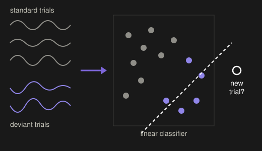
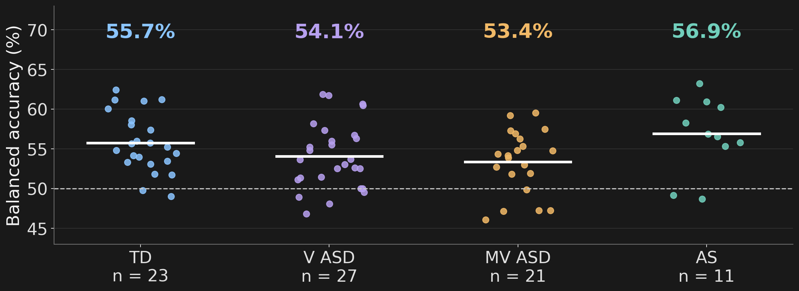
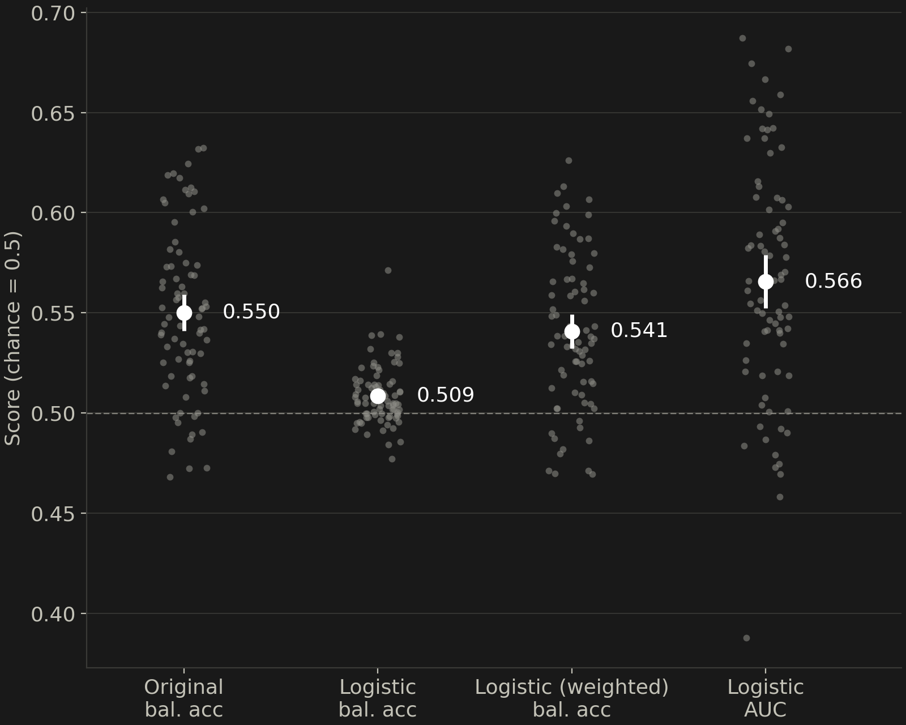
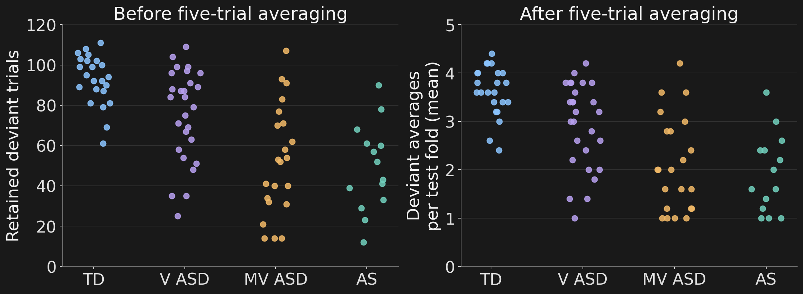
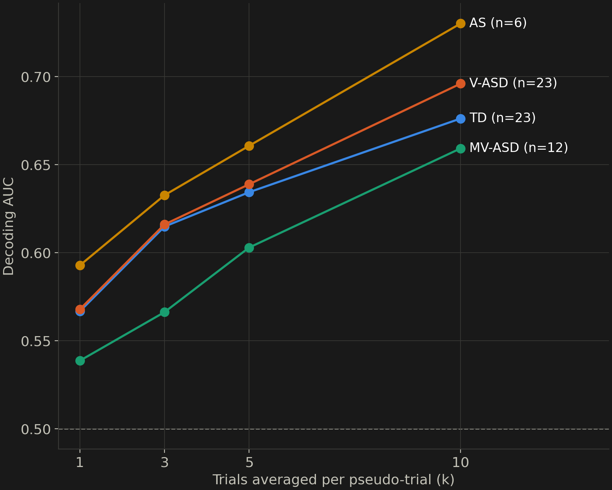
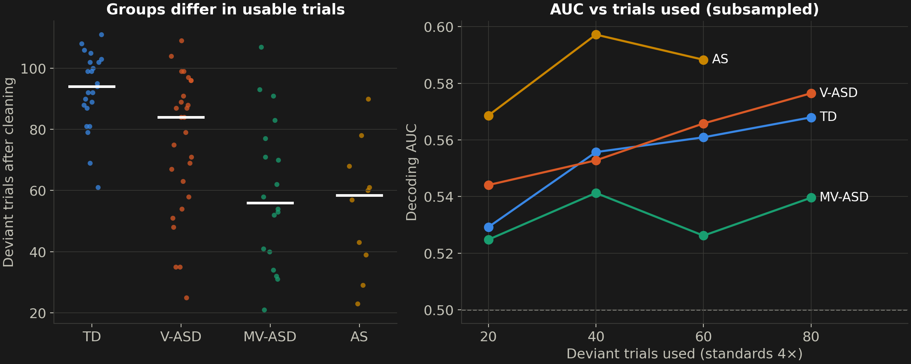
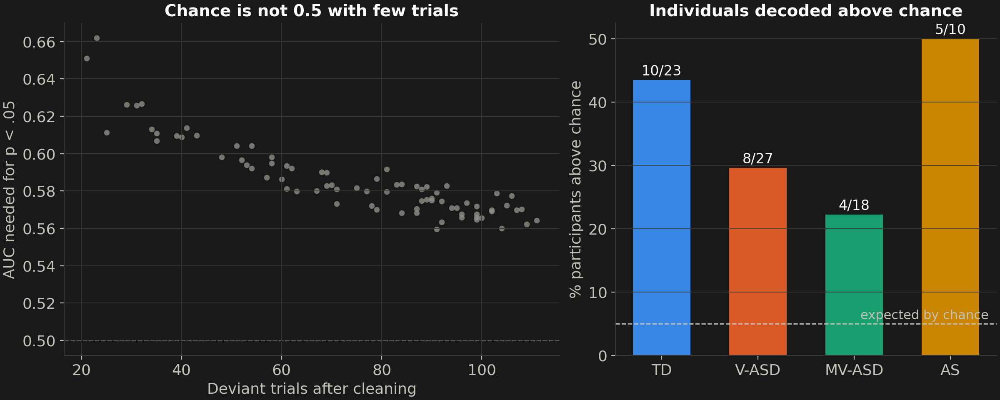
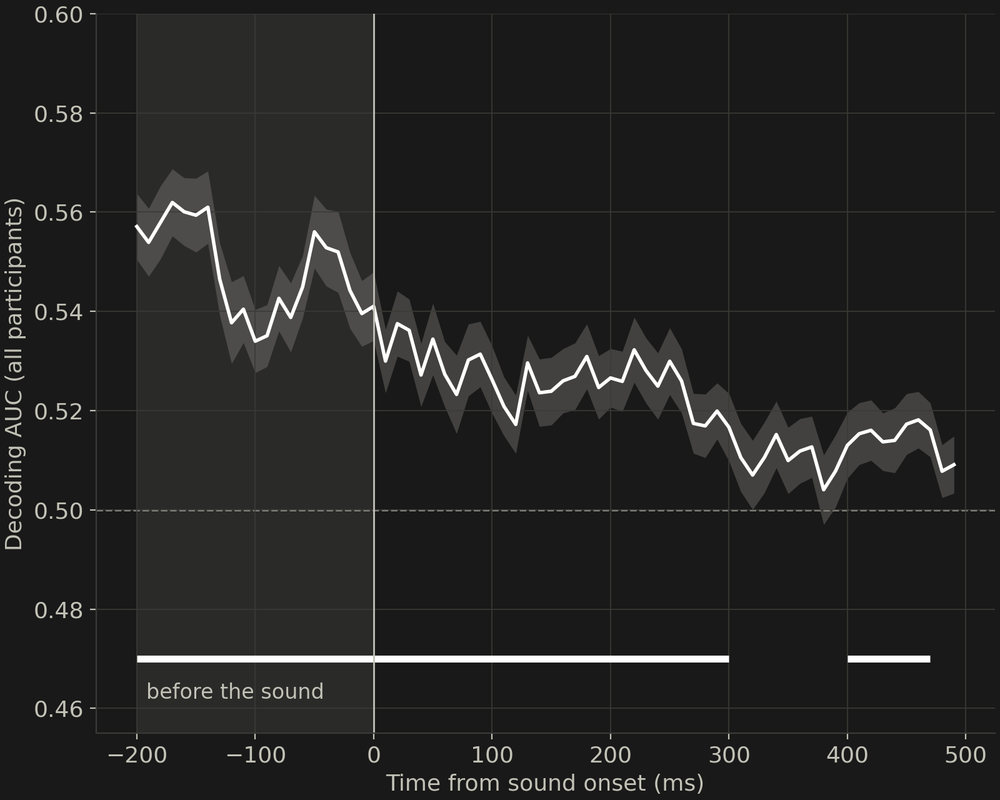
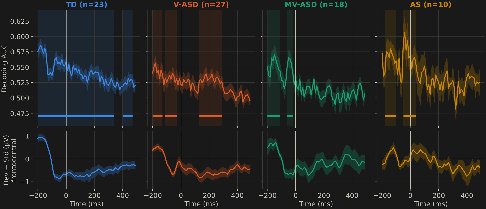

---
author:
  - Scott Huberty
  - Sydney Jacobs
  - Charlotte Distefano
date: today
format:
  revealjs:
    css: gatlinburg.css
institute: University of Southern California
subtitle: Caveats and Guidelines.
title: "Decoding brain activity From EEG in Neurodevelopmental Populations"
title-slide-attributes:
  data-notes: "Timing: 0:20 (cumulative 0:20). Main talk budget is about 12:30 including this slide; backup slides follow the Thanks slide."
---

## Why Decode?

::: {.image-text-slide}

::: {.text-panel}
- ERPs: *does the group respond differently?*
- Decoding: *can we predict something from **this person's** EEG?*
- experimental condition (speech, picture), phenotype etc.
- Adults: ~70% binary accuracy
- Infant / developmental: lower
:::

::: {.image-panel}
{fig-alt="Schematic: single EEG trials become feature vectors; a classifier trained on some trials predicts the condition of held-out trials."}
:::

:::

::: {.notes}
Timing: 1:00 (cumulative 1:20). Group ERPs tell us about averages. Decoding asks whether one person's EEG carries enough information to tell two conditions apart, which is what any individual-level or BCI use would need. Adult binary decoding reaches about 70%; infant and developmental studies report less.
:::

::: {.notes}
Timing: 0:45 (cumulative 2:05). The stimuli are pure tones. We classify the condition of each trial (standard vs deviant), not the diagnostic group.
:::

## Decoding In One Slide

::: {.decode-pipeline}
::: {.workflow-step}
**Single trials**<br>channels × time
:::
::: {.workflow-arrow}
→
:::
::: {.workflow-step}
**Classifier**<br>linear, regularized
:::
::: {.workflow-arrow}
→
:::
::: {.workflow-step}
**Cross-validation**<br>train ≠ test trials
:::
::: {.workflow-arrow}
→
:::
::: {.workflow-step}
**Score**<br>chance = 0.5
:::
:::

```{=html}
<div class="cv-folds" role="img" aria-label="Five-fold cross-validation: trials split into five blocks; each fold tests on one block and trains on the other four, so every trial is tested once.">
  <span class="cv-label">Fold 1</span><span class="cv-test">test</span><span>train</span><span>train</span><span>train</span><span>train</span>
  <span class="cv-label">Fold 2</span><span>train</span><span class="cv-test">test</span><span>train</span><span>train</span><span>train</span>
  <span class="cv-label">Fold 3</span><span>train</span><span>train</span><span class="cv-test">test</span><span>train</span><span>train</span>
  <span class="cv-label">Fold 4</span><span>train</span><span>train</span><span>train</span><span class="cv-test">test</span><span>train</span>
  <span class="cv-label">Fold 5</span><span>train</span><span>train</span><span>train</span><span>train</span><span class="cv-test">test</span>
</div>
<p class="cv-caption">Every trial is tested once, by a model that never saw it. <span>Each test block: ≤ 24 deviants (120 ÷ 5); after 5-trial averaging, ≤ 5.</span></p>
```

- One model per person; standard vs deviant at ~4 : 1
- Always guessing "standard": 80% accuracy, **50% balanced accuracy**

::: {.notes}
Timing: 0:45 (cumulative 3:50). Within each person we train a linear classifier on some trials and test it on held-out trials. Cross-validation repeats this five times: split the trials into five blocks, train on four, test on the fifth, and rotate so every trial is tested once by a model that never saw it. Keep the test block in mind: with 120 deviants it holds at most 24, and after averaging five trials at most 5. Because standards outnumber deviants about four to one, plain accuracy is misleading: always guessing "standard" gets 80%. Balanced accuracy averages the recall of both classes, so that strategy scores 50%.
:::


## Feasibility

::: {.three-part-slide}
- **Who**<br>
  Adolescents: Range of developmental stages.
- **What**<br>
  Decoding of standard vs deviant **pure tones** (480 / 120)
- **Why it is hard**<br>
  Single-trial EEG is noisy, esp in developmental samples.
:::


## Sample

::: {.columns}
::: {.column width="55%"}
::: {.cohort-table}

| Group | People | Recordings | Analyzed |
|:--|--:|--:|--:|
| Typically developing | 23 | 23 | 23 |
| Verbal ASD | 27 | 27 | 27 |
| Minimally verbal ASD | 21 | 22 | 18 |
| Angelman syndrome | 11 | 15 | 10 |
| **Total** | **82** | **87** | **78** |

:::
:::
::: {.column width="45%"}
- Task: Auditory oddball: 480 standard / 120 deviant pure tones
- Analyzed: **one session per person**
- 128-channel EGI Geodesic net
:::
:::

::: {.notes}
Timing: 1:00 (cumulative 3:05). The abstract's N of 86 counted recordings. 87 decoded recordings come from 82 people; four of the five repeat participants are in the Angelman group, so AS shrinks from 14–15 recordings to 11 people. For the re-analysis we kept one session per person, chosen by most usable deviant trials before looking at any scores, and excluded sessions with fewer than 20 usable deviants or no usable data, leaving 78 people.
:::


## Preprocessing For Decoding

::: {.columns .prep-columns}
::: {.column width="52%"}
**Depends on the question**

- Classifiers use artifacts too: eye or muscle activity that differs by condition gets decoded
- Cleaning costs trials: stricter rejection, smaller trial budget
- Data-driven steps (scaling, PCA, averaging) go inside the folds
:::
::: {.column width="48%"}
**What we did**

- 1–40 Hz on continuous data
- ICA to removing eye, muscle, heart, and noise components
- Epochs −200–500 ms, baseline-corrected
- 150 µV rejection; average reference
:::
:::

::: {.notes}
Timing: 0:45 (cumulative TBD). Preprocessing for decoding is not the same as for ERPs. A classifier will use anything that differs between conditions, including artifacts, so artifact removal matters more. Every rejected trial shrinks the trial budget we come back to later. And anything learned from the data, such as scaling, dimension reduction, or averaging, belongs inside the cross-validation folds. Our pipeline: PyLossless cleaning, ICA with ICLabel (components labelled eye, muscle, heart, line noise, or channel noise with confidence above 0.3 removed), 1–40 Hz filter on the continuous data, epochs from −200 to 500 ms with baseline correction, 150 µV rejection, and average reference. Channels flagged bad were kept in the original decoding features and dropped in the re-analysis.
:::

## First Pass: Modestly Above 50%

{.result-figure fig-alt="Participant-level single-trial balanced accuracy from the original pipeline. Means: TD 55.7%, verbal ASD 54.1%, minimally verbal ASD 53.4%, Angelman syndrome 56.9%."}

::: {.source-line}
One dot per person.
:::

::: {.notes}
Timing: 0:45 (cumulative 4:35). This is the abstract's analysis, re-summarized per person. Group means are 54–57%, with wide individual spread. Note that AS is the highest group, not the lowest, once sessions are weighted per person. The rest of the talk asks how far to trust these numbers.
:::

## 1. Choosing the right metric

::: {.image-text-slide}

::: {.image-panel}
{fig-alt="Per-participant scores for four scoring choices, with means: original balanced accuracy 0.550, logistic balanced accuracy 0.509, class-weighted logistic balanced accuracy 0.541, logistic AUC 0.566."}
:::

::: {.text-panel}
- Same model & data:
  - balanced accuracy **0.51**
  - AUC **0.57**
- Classifier priors favour the majority class
- Report **AUC** (threshold-free), or weight the classes
:::

:::

::: {.notes}
Timing: 1:00 (cumulative 5:35). Re-analysis pipeline: 100 Hz, 0–500 ms, L2 logistic regression, repeated 5×5-fold CV. Without class weighting the decision threshold favours standards, so balanced accuracy sits at 0.51 even though the scores separate the classes (AUC 0.57, paired Wilcoxon p < .001). Regularizing and downsampling the original model, and dropping the bad channels it had kept, changed little (0.550 → 0.541 balanced accuracy); the metric choice matters more.
Scenario: Always says "standard," no brain signal used
- Standards: 480 / 480 correct = 100%
- Deviants: 0 / 120 correct = 0%
- Plain accuracy: 480 / 600 = 80%
- Balanced accuracy: (100% + 0%) / 2 = 50%
:::

## 2. Averaging Trials to increase SNR

::: {.nonincremental}
- Average *k* same-condition trials → less noise, but *k*× fewer examples
:::

{.result-figure fig-alt="Left: retained deviant trials per recording by group. Right: mean deviant pseudo-trials per test fold after five-trial averaging, about one to four."}

::: {.source-line}
Original pipeline: 5-trial averages built before cross-validation. One dot per recording.
:::

::: {.notes}
Timing: 1:00 (cumulative 6:35). Because single trials are noisy, a common fix is to average a few trials of the same condition into one "pseudo-trial" and decode those. That cleans up the signal but divides the number of examples: 120 deviants become at most 24 averages at k = 5, before rejected trials, and those are then split across folds. The abstract reported that averaging five trials helped TD and verbal ASD but not MV-ASD or AS. Look at the budget: after averaging, test folds hold one to four deviant averages, and fewest in the groups with fewest trials. With one deviant average in a fold, a single prediction moves deviant recall from 0 to 100%. That evaluation cannot tell us whether averaging helps.
:::

## 3. How many trials should we average?

{.result-figure fig-alt="Decoding AUC when averages are built inside the folds, rising with the number of trials averaged (k = 1, 3, 5, 10) in every group: TD, V-ASD, MV-ASD, and AS."}

- Built inside train and test folds, averaging helps **every group**: 0.56 → 0.69 (k = 10)

::: {.notes}
Timing: 1:15 (cumulative 7:50). Averages built separately within training and test folds and repeated over random groupings: AUC rises with k in every group, including MV-ASD (0.54 → 0.66) and AS (0.59 → 0.73). Caveats: at k = 10 only 12 MV-ASD and 6 AS participants have enough trials, and this decodes averaged responses, not single trials.
:::

## 4. Report Usable Trials

::: {.image-panel .fig-compact}
{fig-alt="Left: usable deviant trials per participant by group. Right: decoding AUC as a function of number of trials used, by group."}
:::

- MV-ASD and AS keep ~35% fewer deviants
- Fewer trials → lower AUC within person (TD, V-ASD)
- Here, group AUC did not differ, with or without trial count

::: {.notes}
Timing: 0:50 (cumulative 8:40). Median usable deviants: TD 94, V-ASD 84, MV-ASD 56, AS 58.5. Subsampling within person lowers AUC for TD and V-ASD. Across people, trial count did not predict AUC (Spearman rho 0.12), and the group effect was not significant with or without trial count as a covariate (p = .16 and .18; p = .08 when everyone is subsampled to 40 deviants). It did not drive our result, but it is a ready-made confound: check it and report it. Fewer participants contribute at higher trial counts in the right panel.
:::

## 5. Don't overlook individuals.

::: {.image-panel .fig-compact}
{fig-alt="Left: AUC required for significance versus number of trials. Right: percentage of participants decoded above chance by group: TD 10 of 23, V-ASD 8 of 27, MV-ASD 4 of 18, AS 5 of 10."}
:::

- Chance is not 0.5: significance needs AUC 0.56–0.66
- Permutation tests: **35%** of individuals above chance

::: {.notes}
Timing: 1:00 (cumulative 9:40). A group mean above 0.5 does not say which people can be decoded. With a 200-permutation test per person, 27 of 78 (35%) are above chance; all groups exceed the 5% expected by chance (binomial p ≤ .011). The threshold depends strongly on trial count: people with ~20 deviants need AUC around 0.65.
For each person, we shuffled the trial labels 200 times and re-ran the decoder, which shows how high the score can go by luck alone for that person. Someone counts as decodable only if their real score beats 95% of those shuffled scores.
:::

## Revised Results

::: {.results-table}

| | TD | V-ASD | MV-ASD | AS |
|---|---|---|---|---|
| Participants | 23 | 27 | 18 | 10 |
| Single-trial AUC | 0.57 | 0.57 | 0.54 | 0.59 |
| Above chance (group) | ✓ | ✓ | ✓ | ✓ |
| Individuals above chance | 10/23 | 8/27 | 4/18 | 5/10 |
| Pseudo-trial AUC (k = 5) | 0.63 | 0.64 | 0.60 | 0.66 |

:::

::: {.source-line}
Groups did not differ (p = .16). Decoding is also above chance *before* sound onset; see backup.
:::

::: {.notes}
Timing: 0:50 (cumulative 10:30). Single-trial decoding is weak but above chance at the group level in every group (one-sided Wilcoxon, p ≤ .014). About a third of individuals pass their own test, and averaging inside the folds raises AUC everywhere. Groups did not differ significantly. One caveat, detailed in backup: the conditions are also decodable before the sound, and the ERP starts before 0 ms, which points to an event-timing or filtering problem to resolve before interpreting timing.
:::

## Recommendations

::: {.checklist}
- Define the prediction target: single trial, average etc.
- Use **AUC** (or class weights) with imbalanced designs
- Test **individuals** with permutation nulls
- **Decode the baseline** as a sanity check
:::

::: {.notes}
Timing: 1:00 (cumulative 11:30). Seven cheap checks; each one changed our interpretation of this dataset.
:::

## Limitations & Next Steps

- Noise or more variable responses in MV-ASD / AS?
- Link decoding to language scores (planned)
- Explore non-linear classifiers, foundation models, etc.

::: {.notes}
Timing: 0:45 (cumulative 12:15). First, check the event timing: decoding and the ERP both start before 0 ms. Then ask whether lower decodability in some participants reflects noise or more variable auditory processing; repeat sessions give a first test–retest check. Associations with language scores are planned and not analyzed here.
:::

## Thank You

- Families and participants
- Co-authors: Sydney Jacobs, Charlotte Distefano
- University of Southern California
- Code: MNE-Python, scikit-learn

::: {.notes}
Timing: 0:15 (cumulative 12:30).
:::

# Backup

## Decoding Before The Sound {#backup-baseline}

::: {.image-text-slide}

::: {.image-panel}
{fig-alt="Group-mean time-resolved decoding AUC from −200 to 500 ms; AUC is above chance before sound onset."}
:::

::: {.text-panel}
- AUC = **0.55** before onset (p < .001)
- Shuffled labels: 0.50
- Not carry-over, sequence position, or drift
- Candidate causes:
  - markers offset from sound onset
  - 1 Hz high-pass + baseline correction
:::

:::

::: {.notes}
Backup. The conditions are decodable before the sound (mean pre-stimulus AUC 0.549, p < .001; 53 of 78 participants peak before onset). Ruled out on 8 participants: classifier bias (label-shuffle null 0.501 ± 0.010), previous-trial carry-over, run-length position, drift, and epoch-filter smearing. Two candidates remain: event markers placed after the true sound onset, or a 1 Hz high-pass on continuous data followed by baseline correction (van Driel, Olivers & Fahrenfort, 2021). The events files have no audio-onset channel, so this could not be checked.
:::

## Time Course And ERP By Group {#backup-time-course}

{.result-figure fig-alt="Time-resolved decoding AUC (top) and deviant-minus-standard ERP (bottom) for each group."}

::: {.source-line}
Bars: clusters above chance (one-sided cluster permutation). In MV-ASD and AS, significant clusters are only before onset. The difference wave turns negative near −100 ms.
:::

::: {.notes}
Backup. The grand-average ERP shows no clear N1 after onset, and the deviant negativity begins around −100 ms. A sharp onset like this is more typical of a timing offset than a filter smear. If the markers are offset, fixed MMN windows (100–300 ms) are misplaced too.
:::

## Baseline Diagnostics {#backup-diagnostics}

::: {.results-table}

| Check (8 participants) | Pre-stimulus AUC | 100–300 ms AUC |
|---|---|---|
| Real labels | 0.556 | 0.525 |
| Label-shuffle null (20 per person) | 0.501 ± 0.010 | 0.505 ± 0.012 |
| No smearing (10 ms bins) | 0.556 | 0.526 |
| Standards after a deviant removed | 0.558 | 0.536 |
| Standards matched on sequence position | 0.554 | 0.541 |

:::

::: {.notes}
Backup. Diagnostics run on 8 participants with the time-resolved decoder. None of these controls removes the pre-stimulus effect.
:::

## Analysis Details {#backup-methods}

::: {.methods-table}

| Component | Re-analysis |
|:--|:--|
| Epochs | −200–500 ms; 150 µV rejection; average reference |
| Features | 0–500 ms in 10 ms bins (100 Hz), all channels |
| Model | Scaler + L2 logistic, class-weighted (C = 0.001; per-bin C = 1) |
| Evaluation | Repeated 5 × 5-fold CV; AUC and balanced accuracy |
| Individuals | 200-permutation test per participant |
| Averaging | Pseudo-trials within train and test folds, k = 1–10 |
| Sample | One session per person; ≥ 20 usable deviants |

:::

::: {.notes}
Backup. The pipeline was fixed in advance from an 8-participant pilot; no tuning. The original pipeline used all 701 samples at 1 kHz with unregularized LDA and single 5-fold CV, and kept channels flagged bad in its features; the re-analysis drops them.
:::

## References {#backup-references}

::: {.source-line}

Bayet, L., et al. (2020). Temporal dynamics of visual representations in the infant brain. *Developmental Cognitive Neuroscience, 45*, 100860.

Grootswagers, T., Wardle, S. G., & Carlson, T. A. (2017). Decoding dynamic brain patterns from evoked responses. *Journal of Cognitive Neuroscience, 29*(4), 677–697. doi:10.1162/jocn_a_01068

Gwilliams, L., King, J.-R., Marantz, A., & Poeppel, D. (2022). Neural dynamics of phoneme sequences reveal position-invariant code for content and order. *Nature Communications, 13*, 6606.

van Driel, J., Olivers, C. N. L., & Fahrenfort, J. J. (2021). High-pass filtering artifacts in multivariate classification of neural time series data. *Journal of Neuroscience Methods, 352*, 109080.

Varoquaux, G., et al. (2017). Assessing and tuning brain decoders: Cross-validation, caveats, and guidelines. *NeuroImage, 145*, 166–179. doi:10.1016/j.neuroimage.2016.10.038

:::
