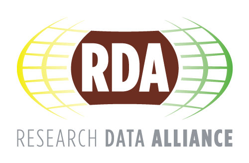
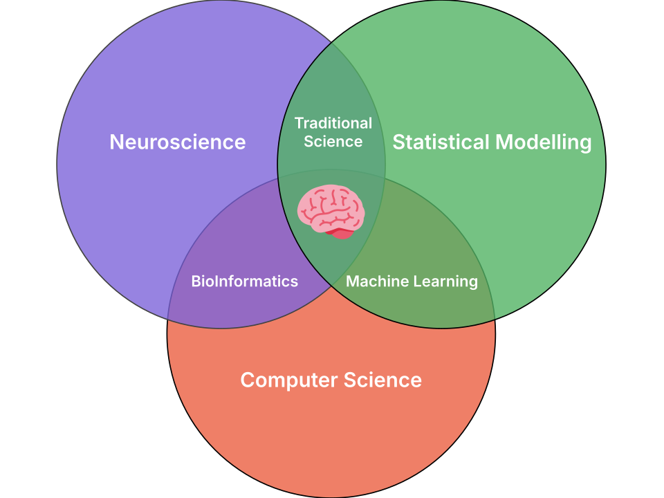
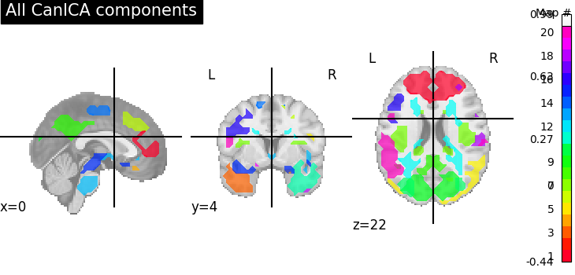
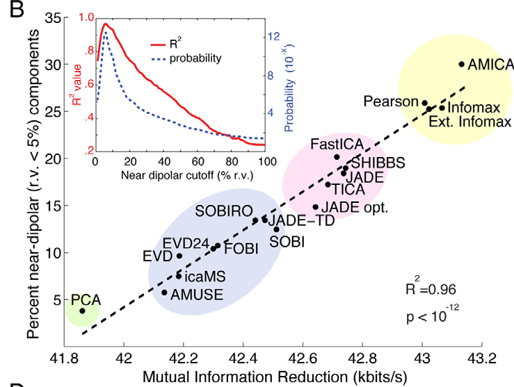
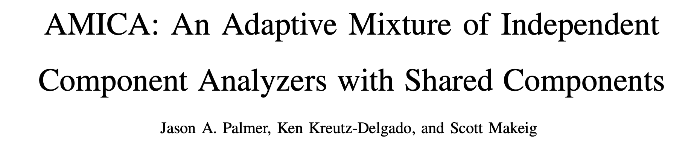
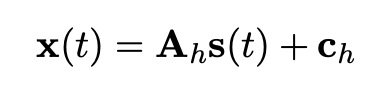
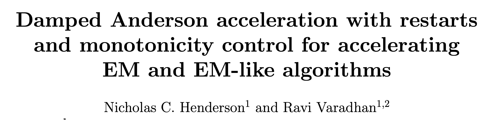
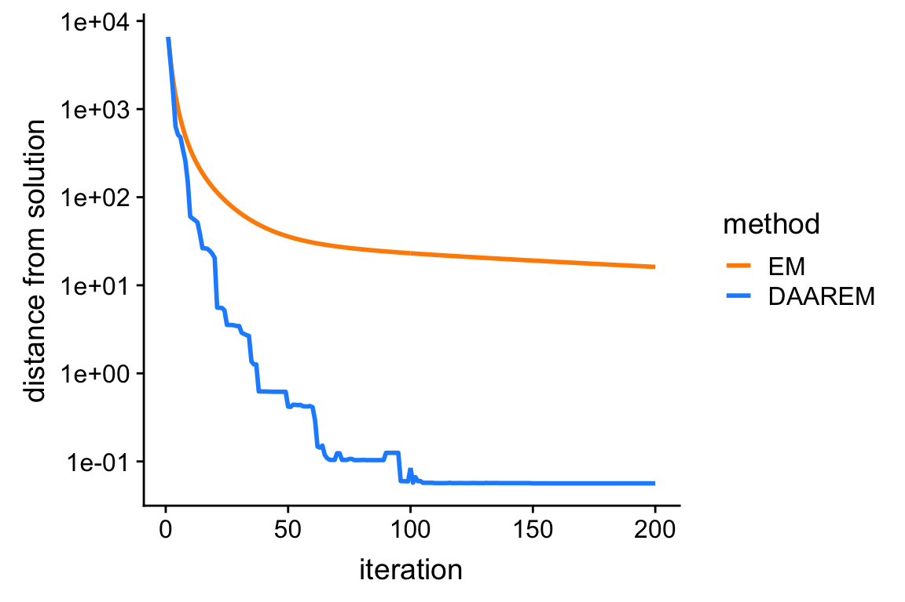
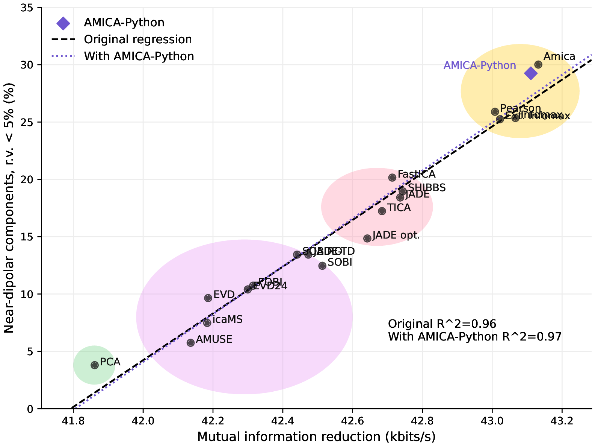
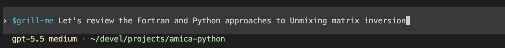

# Introduction

## My Background

::: {.profile-slide}

::: {.profile-copy}
- Scientific researcher
  - `PhD`: Neuroscience, McGill
  - `Current`: Postdoctoral researcher, USC
- Focus: software and methods for neuroscience
  - NSF Pathways for Open Source Ecosystems
:::

::: {.profile-logos}
{fig-alt="McGill University logo"}
:::

:::

## Open Source Background

::: {.background-slide}

::: {.background-copy}
- Open source developer
- Active in the Scientific Python ecosystem
- MNE-Python core developer
:::

::: {.background-logos}
{fig-alt="MNE-Python logo"}
{fig-alt="US Research Software Engineer Association logo"}
{fig-alt="Research Data Alliance logo"}
{fig-alt="Research Software Alliance logo"}
:::

:::

## Can AI Fit Into Scientific Work?

::: {.modern-scientist-slide}

::: {.modern-scientist-equation}
`modern_research = "domain-knowledge" + "statistics" + "computation"`{.python .research-equation}
:::

::: {.modern-scientist-copy}
- AI can accelerate parts of the toolkit
- The domain expert still closes the loop
  - Are field-specific assumptions valid?
  - Does the result make scientific sense?
:::

::: {.modern-scientist-figure}
{fig-alt="Diagram showing the modern scientist at the intersection of domain knowledge, statistics, and computation."}
:::

:::

## Talk Shape

::: {.three-part-slide}
- **Use cases**<br>
  Where agentic LLMs help my research and exploration.
- **Controls**<br>
  How I keep the work grounded, testable, and reviewable.
- **Example**<br>
  A concrete workflow from AMICA to `amica-python`.
:::

## My Approach

::: {.process-row}
1. `Frame`
2. `Gather`
3. `Implement`
4. `Review`
5. `Capture`
:::

# Example: AMICA-Python

## Problem: Source Separation

::: {.image-text-slide}

::: {.image-panel}
{fig-alt="CANICA example figure."}
:::

::: {.text-panel}
- Much of neuroscience depends on `source separation`
- `Independent Components Analysis` is used to:
  - separate brain activity from artifact
  - identify functional brain networks in MRI
:::

:::

## Why AMICA?

::: {.image-text-slide}

::: {.image-panel}
{fig-alt="Original AMICA example figure from Delorme and colleagues."}
:::

::: {.text-panel}
- Adaptive Mixture ICA (AMICA)
  - powerful, but computationally heavy
  - written in Fortran in 2008
- Goal: make the algorithm easier to inspect, test, and extend
:::

:::

## Idea

- Implement AMICA in Python
- Keep the API independent of any single application domain, such as EEG
- Use the rewrite to make better design decisions along the way

# Step 2: Context

## Make The Model Context-Aware

::: {.image-text-slide}

::: {.image-panel}
{fig-alt="Screenshot showing the title of Jason Palmer's 2011 paper on AMICA."}
:::

::: {.text-panel}
- How can we efficiently make the LLM aware of project-specific and field-specific information?
- Useful context includes:
  - AMICA literature
  - existing Fortran implementation
  - expected numerical behavior
:::

:::

## Convert PDFs Into Agent-Friendly Text

I use `mathpix` to convert scientific PDFs into Markdown and LaTeX that an LLM agent can inspect.

```console
$ npm install -g @mathpix/mpx-cli

$ mpx login
? Mathpix Snip Account Email: example@mathpix.com
? Mathpix Snip Account Password: [hidden]

$ mpx convert Palmer-2011_amica_a.pdf Palmer-2011_amica-paper.md
Converted Palmer-2011_amica_a.pdf to Palmer-2011_amica-paper.md in 4955ms
```

## From PDF Math To Source Text

::: {.code-comparison-slide}

::: {.image-panel}
{fig-alt="Rendered ICA mixing formula."}
:::

::: {.code-panel}
```latex
$$
\mathbf{x}(t)=\mathbf{A} \mathbf{s}(t)
$$
```
:::

:::

## Project Context

```text
amica-python/
├── .codex/
│   ├── config.toml
│   └── hooks.json
├── AGENTS.md
├── src/
│   ├── core.py
│   └── utils.py
├── data/
│   ├── raw_data.set
│   └── clean_data.set
├── fortran/
│   ├── amica15.f90
│   └── amica15_header.f90
├── papers/
│   ├── Palmer-2011-amica.md
│   └── Palmer-2006-newton.md
└── output/
    ├── report.html
    └── report.pdf
```

# Step 3: Implementation

## LLMs Need Guardrails

- LLMs make code generation cheap
- Cheap code raises the importance of verification
- The first question becomes: `does it work?`

## Red-Green TDD

- Test-driven development: write tests first, then implement the code that makes them pass
- I did not test only the final program output
- The rewrite was checked at the function and module level

## Red-Green TDD: Matrix Inversion

::: {.code-comparison-slide}

::: {.code-panel}
```f90
! Build unmixing matrix W = inv(A) using LU factorization
call DCOPY(nw*nw,A(:,comp_list(:,h)),1,W(:,:,h),1)
call DGETRF(nw,nw,W(:,:,h),nw,ipivnw,info)
call DGETRI(nw,W(:,:,h),nw,ipivnw,work,lwork,info)
```
:::

::: {.code-panel}
```python
A_fort = np.fromfile("A.bin", dtype=np.float64)
W_fort = np.fromfile("W.bin", dtype=np.float64)

W = torch.linalg.inv(A)
np.testing.assert_allclose(W_fort, W)
```
:::

:::

## Red-Green TDD: Anderson Acceleration

::: {.image-text-slide}

::: {.image-panel}
{fig-alt="DAAREM package reference figure."}
:::

::: {.text-panel}
- AMICA is an EM algorithm, and EM can be slow
- Could an acceleration scheme improve convergence?
- Challenge: implement the accelerator correctly, not just plausibly
:::

:::

## Red-Green TDD: Anderson Acceleration

::: {.image-text-slide}

::: {.image-panel}
{fig-alt="Benchmark plot for DAAREM behavior."}
:::

::: {.text-panel}
- Find an existing implementation to use as a benchmark
- Save the expected result
- Write a Python test that asserts equality to the benchmark
- Iterate until the implementation passes
:::

:::

## Updated Project Context

```text
amica-python/
├── .codex/
│   ├── config.toml
│   └── hooks.json
├── AGENTS.md
├── src/
│   ├── core.py
│   ├── utils.py
│   └── tests/
│       └── test_daarem.py
├── data/
│   ├── raw_data.set
│   └── clean_data.set
├── fortran/
│   ├── amica15.f90
│   ├── amica15_header.f90
│   └── daarem.R
├── papers/
│   ├── daarem.md
│   ├── Palmer-2011-amica.md
│   └── Palmer-2006-newton.md
└── output/
    ├── report.html
    └── report.pdf
```

## Success: Reproducing The Delorme Result

::: {.result-comparison-slide}

::: {.result-panel}
**Original AMICA result**

{fig-alt="Original Delorme AMICA figure."}
:::

::: {.result-panel}
**AMICA-Python reproduction**

{fig-alt="AMICA-Python reproduction of the Delorme AMICA figure."}
:::

:::

# Tooling Hygiene

## MCP Servers

```toml
[mcp_servers.polars]
command = "/Users/scotterik/.local/bin/uvx"
args = ["--with", "polars==1.41.2", "polars-mcp"]
startup_timeout_sec = 20
tool_timeout_sec = 60
enabled = true
```

- Reduces hallucinations for fast-moving or niche packages
- Useful when model training data lags the current library API

## Version Control

- LLMs accelerate development
- Commit after each successful TDD cycle
- Small commits make unsuccessful patches easy to revert

## Hooks

- Connect preferred tooling to the LLM workflow
- `Package managers`: point the agent to `conda`, `uv`, or project-specific tools
- `Linters`: Ruff, Codespell, `ty`
- `Tests`: run focused checks after file edits
- Type checking is often cheaper than running the full test suite

## Hook Example

```json
{
  "hooks": {
    "SessionStart": [
      {
        "matcher": "startup|resume",
        "hooks": [
          {
            "type": "command",
            "command": "bash -c 'source /Users/scotterik/miniforge3/etc/profile.d/conda.sh && conda activate mnedev_311'",
            "statusMessage": "Activating Conda Environment"
          }
        ]
      }
    ],
    "PostToolUse": [
      {
        "matcher": "^(apply_patch|functions\\.apply_patch)$",
        "hooks": [
          {
            "type": "command",
            "command": "/Users/scotterik/miniforge3/envs/mnedev_311/bin/ruff check",
            "timeout": 30,
            "statusMessage": "Running Ruff linter"
          }
        ]
      }
    ]
  }
}
```

# Alignment

## LLMs Need Alignment

::: {.image-text-slide}

::: {.image-panel}
{fig-alt="Screenshot showing agent skills."}
:::

::: {.text-panel}
- LLMs accelerate development
- They can also accelerate codebase entropy
- The workflow needs ways to surface misalignment early
:::

:::

## Grill Me

::: {.image-text-slide}

::: {.image-panel}
{fig-alt="Screenshot of the grill-me skill."}
:::

::: {.text-panel}
- Part of the `mattpocock/skills` ecosystem
- Creates a structured pair-programming loop with the LLM
- Useful before implementation, during design, and when reviewing tradeoffs
:::

:::

## Why I Use Grill Me

::: {.image-text-slide}

::: {.image-panel}
{fig-alt="Humorous image representing a grill-me workflow."}
:::

::: {.text-panel}
- As a program evolves, its entropy tends to increase
- LLMs produce code quickly, so entropy can accumulate quickly
- Pair review increases alignment and catches anti-patterns earlier
:::

:::

## Other Useful Skills

- `grill-me-with-docs`
- `/to-issues`
  - turn a discovered bug or follow-up into a GitHub issue
- `/tdd`
  - run a red-green loop during implementation or refactoring
- `/diagnose`
  - debug a bug or performance regression with a structured feedback loop

# Summary

## What Works For Me

- Give the model relevant files and constraints
  - check claims against source material
- Ask for specific outputs instead of broad advice
  - use TDD when expected outputs are available
- Treat generated work as a draft that needs review

## Why This Workflow Works

- `Context`: keeps source material close to the work
- `Alignment`: clarifies the problem, goal, and scope
- `Implementation`: creates tests that must pass
- `Version control`: preserves reproducibility and reversibility

## Next Steps

- Update `website.site-url` in `_quarto.yaml` before publishing
- Explore `sandcastle` for multi-agent orchestration
- Add MCP servers for scientific Python packages